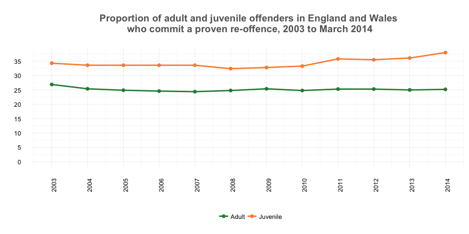
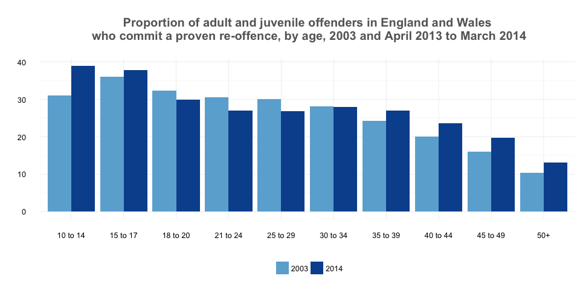
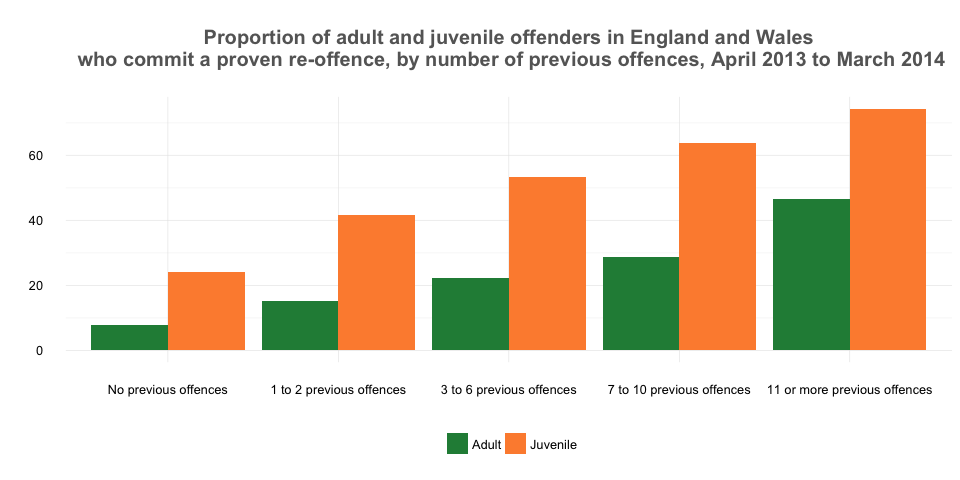
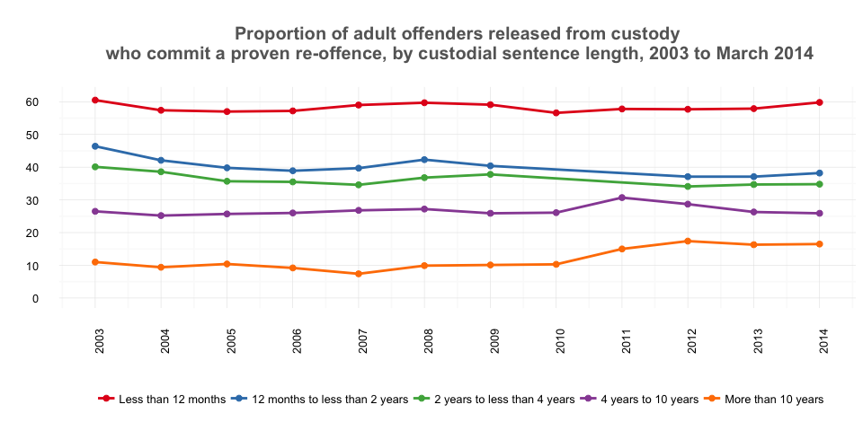

Proven Re-offending figures
================

The following R code recreates the figures published in the Ministry of Justice's [Proven Re-offending Statistics Quarterly Bulletin, April 2013 to March 2014](https://www.gov.uk/government/uploads/system/uploads/attachment_data/file/495758/proven-reoffending-2014q1.pdf), using [ggplot2](https://cran.r-project.org/web/packages/ggplot2/index.html).

<br>
<hr>
###### Read and tidy the Ministry of Justice proven reoffending and index disposal [data](https://www.gov.uk/government/uploads/system/uploads/attachment_data/file/495646/CSVs.zip)

``` r
library(tidyr) ; library(dplyr) ; library(ggplot2) ; library(scales) ; library(stringr) ; library(lubridate)

df1 <- read.csv("proven_re-offending_overview_apr13-mar14.csv", header = T) %>% 
  filter(grepl("Dec", cohort)) %>% 
  separate(cohort, into = c("prefix", "year"), sep = -5) %>% 
  select(-prefix, cohort = year) %>% 
  mutate(cohort = as.Date(paste(cohort,"-01-01",sep=""))) %>% 
  filter(cohort >= "2003-01-01", cohort <= "2005-01-01") 

df2 <- read.csv("proven_re-offending_overview_apr13-mar14.csv", header = T) %>% 
  filter(grepl("Mar", cohort)) %>% 
  separate(cohort, into = c("prefix", "year"), sep = -5) %>% 
  select(-prefix, cohort = year) %>% 
  mutate(cohort = as.Date(paste(cohort,"-01-01",sep="")))

reoffending <- rbind(df1, df2)

df3 <- read.csv("IndexDisposal_apr13-mar14.csv", header = T) %>% 
  filter(grepl("Dec", cohort)) %>% 
  separate(cohort, into = c("prefix", "year"), sep = -5) %>% 
  select(-prefix, cohort = year) %>% 
  mutate(cohort = as.Date(paste(cohort,"-01-01",sep=""))) %>% 
  filter(cohort > "2002-01-01") %>% 
  mutate(offenders = as.numeric(as.character((offenders))),
         reoffenders = as.numeric(as.character((reoffenders))),
         reoffences = as.numeric(as.character((reoffences)))) %>% 
  filter(cohort >= "2002-01-01", cohort <= "2005-01-01")

df4 <- read.csv("IndexDisposal_apr13-mar14.csv", header = T) %>% 
  filter(grepl("Mar", cohort)) %>% 
  separate(cohort, into = c("prefix", "year"), sep = -5) %>% 
  select(-prefix, cohort = year) %>% 
  mutate(cohort = as.Date(paste(cohort,"-01-01",sep=""))) %>% 
  filter(cohort > "2003-01-01") %>% 
  mutate(offenders = as.numeric(as.character((offenders))),
         reoffenders = as.numeric(as.character((reoffenders))),
         reoffences = as.numeric(as.character((reoffences))))

disposal <- rbind(df3, df4)

rm(df1, df2, df3, df4)
```

<hr>
<br>

###### Table 1: Summary statistics

``` r
tbl <- reoffending %>% 
  filter(category == "a. Ethnicity and sex" & cohort == "2014-01-01") %>%
  group_by(adult_juvenile) %>% 
  summarise(`Number of re-offences` = sum(reoffences, na.rm=TRUE),
            `Number of re-offenders` = sum(reoffenders, na.rm=TRUE),
            `Number of offenders in cohort` = sum(offenders, na.rm=TRUE)) %>%
  mutate(`Proportion of offenders who re-offend (%)` = round((`Number of re-offenders` / `Number of offenders in cohort`)*100, 1),
         `Average number of re-offences per re-offender` = round((`Number of re-offences` / `Number of re-offenders`), 1),
         `Average number of re-offences per offender` = round((`Number of re-offences` / `Number of offenders in cohort`), 1)) %>% 
  select(`Adult/Juvenile` = adult_juvenile, 
         `Proportion of offenders who re-offend (%)`, 
         `Average number of re-offences per re-offender`, 
         `Average number of re-offences per offender`,
         `Number of re-offences`, `Number of re-offenders`, `Number of offenders in cohort`)

knitr::kable(tbl, caption = "April 2013 to March 2014", format = "html",
             row.names = FALSE, padding = 0, format.args = list(decimal.mark = ".", big.mark = ","),
             align = "l")
```

<table>
<caption>
April 2013 to March 2014
</caption>
<thead>
<tr>
<th style="text-align:left;">
Adult/Juvenile
</th>
<th style="text-align:left;">
Proportion of offenders who re-offend (%)
</th>
<th style="text-align:left;">
Average number of re-offences per re-offender
</th>
<th style="text-align:left;">
Average number of re-offences per offender
</th>
<th style="text-align:left;">
Number of re-offences
</th>
<th style="text-align:left;">
Number of re-offenders
</th>
<th style="text-align:left;">
Number of offenders in cohort
</th>
</tr>
</thead>
<tbody>
<tr>
<td style="text-align:left;">
Adult
</td>
<td style="text-align:left;">
25.2
</td>
<td style="text-align:left;">
3.1
</td>
<td style="text-align:left;">
0.8
</td>
<td style="text-align:left;">
367,605
</td>
<td style="text-align:left;">
117,864
</td>
<td style="text-align:left;">
468,134
</td>
</tr>
<tr>
<td style="text-align:left;">
Juvenile
</td>
<td style="text-align:left;">
38.0
</td>
<td style="text-align:left;">
3.1
</td>
<td style="text-align:left;">
1.2
</td>
<td style="text-align:left;">
50,184
</td>
<td style="text-align:left;">
16,083
</td>
<td style="text-align:left;">
42,299
</td>
</tr>
</tbody>
</table>
<hr>
<br>

###### Figure 1: Proportion of adult and juvenile offenders in England and Wales who commit a proven re-offence, 2003 to March 2014

``` r
df <- reoffending %>% 
  filter(category == "a. Ethnicity and sex") %>%
  group_by(cohort, adult_juvenile) %>% 
  summarise(`Number of re-offences` = sum(reoffences, na.rm=TRUE),
            `Number of re-offenders` = sum(reoffenders, na.rm=TRUE),
            `Number of offenders in cohort` = sum(offenders, na.rm=TRUE)) %>%
  mutate(`Proportion of offenders who re-offend (%)` = round((`Number of re-offenders` / `Number of offenders in cohort`)*100, 1),
         `Average number of re-offences per re-offender` = round((`Number of re-offences` / `Number of re-offenders`), 1),
         `Average number of re-offences per offender` = round((`Number of re-offences` / `Number of offenders in cohort`), 1)) %>% 
  select(cohort, adult_juvenile, 
         `Proportion of offenders who re-offend (%)`, 
         `Average number of re-offences per re-offender`, 
         `Average number of re-offences per offender`,
         `Number of re-offences`, `Number of re-offenders`, `Number of offenders in cohort`)

  ggplot(df, aes(cohort, `Proportion of offenders who re-offend (%)`, color=adult_juvenile)) +
  geom_line(size = 1) + geom_point(size = 2) +
  scale_color_manual(values = c("#238b45", "#fd8d3c")) +
  labs(x="", y="", fill="") +
  theme_minimal() + 
  scale_x_date(date_breaks = "1 year", date_labels = "%Y") +
  scale_y_continuous(labels = comma, 
                     breaks=seq(0, max(df$`Proportion of offenders who re-offend (%)`), 5),
                     limits = c(0, max(df$`Proportion of offenders who re-offend (%)`))) +
  theme(axis.text.x=element_text(angle=+90)) +
  theme(legend.title=element_blank(), legend.position = "bottom") +
  ggtitle("\nProportion of adult and juvenile offenders in England and Wales\n who commit a proven re-offence, 2003 to March 2014\n") +
  theme(plot.title = element_text(color="#666666", face="bold", size=15, hjust=0.5))
```

<!-- -->

<hr>
<br>

###### Figure 2: Proportion of adult and juvenile offenders in England and Wales who commit a proven re-offence, by sex, 2003 to March 2014

``` r
df <- reoffending %>% 
  filter(category == "a. Ethnicity and sex") %>%
  group_by(cohort, subcategory2) %>% 
  summarise(`Number of re-offences` = sum(reoffences, na.rm=TRUE),
            `Number of re-offenders` = sum(reoffenders, na.rm=TRUE),
            `Number of offenders in cohort` = sum(offenders, na.rm=TRUE)) %>%
  mutate(`Proportion of offenders who re-offend (%)` = round((`Number of re-offenders` / `Number of offenders in cohort`)*100, 1),
         `Average number of re-offences per re-offender` = round((`Number of re-offences` / `Number of re-offenders`), 1),
         `Average number of re-offences per offender` = round((`Number of re-offences` / `Number of offenders in cohort`), 1)) %>% 
  select(cohort, subcategory2, 
         `Proportion of offenders who re-offend (%)`, 
         `Average number of re-offences per re-offender`, 
         `Average number of re-offences per offender`,
         `Number of re-offences`, `Number of re-offenders`, `Number of offenders in cohort`) 

df$subcategory2 <- factor(df$subcategory2, 
                            levels=c("a. Female", "a. Male"),
                            labels=c("Female", "Male"))

ggplot(df, aes(cohort, `Proportion of offenders who re-offend (%)`, color=subcategory2)) +
  geom_line(size = 1) + geom_point(size = 2) +
  scale_color_manual(values = c("#6a3d9a", "#cab2d6")) +
  labs(x="", y="", fill="") +
  theme_minimal() + 
  scale_x_date(date_breaks = "1 year", date_labels = "%Y") +
  scale_y_continuous(labels = comma, 
                     breaks=seq(0, max(df$`Proportion of offenders who re-offend (%)`), 5),
                     limits = c(0, max(df$`Proportion of offenders who re-offend (%)`))) +
  theme(axis.text.x=element_text(angle=+90)) +
  theme(legend.title=element_blank(), legend.position = "bottom") +
  ggtitle("\nProportion of adult and juvenile offenders in England and Wales\n who commit a proven re-offence by sex, 2003 to March 2014\n") +
  theme(plot.title = element_text(color="#666666", face="bold", size=15, hjust=0.5))
```

<!-- -->

<hr>
<br>

###### Figure 3: Proportion of adult and juvenile offenders in England and Wales who commit a proven re-offence, by age, 2003 and April 2013 to March 2014

``` r
df <- reoffending %>% 
  filter(category == "b. Index offence by age and region" & cohort == "2003-01-01" |
           category == "b. Index offence by age and region" & cohort == "2014-01-01") %>%
  group_by(cohort, subcategory2) %>% 
  summarise(`Number of re-offences` = sum(reoffences, na.rm=TRUE),
            `Number of re-offenders` = sum(reoffenders, na.rm=TRUE),
            `Number of offenders in cohort` = sum(offenders, na.rm=TRUE)) %>%
  mutate(`Proportion of offenders who re-offend (%)` = round((`Number of re-offenders` / `Number of offenders in cohort`)*100, 1),
         `Average number of re-offences per re-offender` = round((`Number of re-offences` / `Number of re-offenders`), 1),
         `Average number of re-offences per offender` = round((`Number of re-offences` / `Number of offenders in cohort`), 1)) %>% 
  select(cohort, subcategory2, 
         `Proportion of offenders who re-offend (%)`, 
         `Average number of re-offences per re-offender`, 
         `Average number of re-offences per offender`,
         `Number of re-offences`, `Number of re-offenders`, `Number of offenders in cohort`) %>% 
  ungroup() %>% 
  mutate(cohort = year(cohort))
  
ggplot(df, aes(subcategory2, `Proportion of offenders who re-offend (%)`, fill=factor(cohort))) +
  geom_bar(stat="identity", position="dodge") +
  scale_fill_manual(values = c("#6baed6", "#08519c")) +
  labs(x="", y="", fill="") +
  theme_minimal() + 
  scale_x_discrete(limits=c("b. 10 to 14", "b. 15 to 17", "b. 18 to 20", "b. 21 to 24", "b. 25 to 29",
                            "b. 30 to 34", "b. 35 to 39", "b. 40 to 44", "b. 45 to 49", "b. 50+"),
                   labels=c("10 to 14", "15 to 17", "18 to 20", "21 to 24", "25 to 29",
                            "30 to 34", "35 to 39", "40 to 44", "45 to 49", "50+")) +
  scale_y_continuous(labels = comma) +
  theme(legend.title=element_blank(), legend.position = "bottom") +
  ggtitle("\nProportion of adult and juvenile offenders in England and Wales\n who commit a proven re-offence, by age, 2003 and April 2013 to March 2014\n") +
  theme(plot.title = element_text(color="#666666", face="bold", size=15, hjust=0.5))
```

<!-- -->

<hr>
<br>

###### Figure 4: Proportion of adult and juvenile offenders in England and Wales who commit a proven re-offence, by index offence, April 2013 to March 2014

``` r
df <- reoffending %>% 
  filter(category == "b. Index offence by age and region" &
         cohort == "2014-01-01") %>%
  group_by(subcategory1, adult_juvenile) %>% 
  summarise(`Number of re-offences` = sum(reoffences, na.rm=TRUE),
            `Number of re-offenders` = sum(reoffenders, na.rm=TRUE),
            `Number of offenders in cohort` = sum(offenders, na.rm=TRUE)) %>%
  mutate(`Proportion of offenders who re-offend (%)` = round((`Number of re-offenders` / `Number of offenders in cohort`)*100, 1),
         `Average number of re-offences per re-offender` = round((`Number of re-offences` / `Number of re-offenders`), 1),
         `Average number of re-offences per offender` = round((`Number of re-offences` / `Number of offenders in cohort`), 1)) %>% 
  select(subcategory1, adult_juvenile,
         `Proportion of offenders who re-offend (%)`, 
         `Average number of re-offences per re-offender`, 
         `Average number of re-offences per offender`,
         `Number of re-offences`, `Number of re-offenders`, `Number of offenders in cohort`) %>% 
  filter(subcategory1 != "b. Other")

df$subcategory1 <- factor(df$subcategory1, 
                           levels=c("b. Criminal Damage and Arson", "b. Drug", "b. Fraud", "b. Miscellaneous Crimes Against Society", 
                                    "b. Possession of Weapons", "b. Public Order", "b. Robbery", "b. Sexual",
                                    "b. Summary Motoring", "b. Summary Non-motoring", "b. Theft", "b. Violence Against the Person"),
                         labels=c("Criminal Damage and Arson", "Drug", "Fraud", "Misc Crimes Against Society", 
                                  "Possession of Weapons", "Public Order", "Robbery", "Sexual",
                                  "Summary Motoring", "Summary Non-motoring", "Theft", "Violence Against the Person"))

ggplot(df, aes(reorder(subcategory1, -`Proportion of offenders who re-offend (%)`), `Proportion of offenders who re-offend (%)`, fill=adult_juvenile)) +
  geom_bar(stat="identity", position="dodge") +
  scale_fill_manual(values = c("#238b45", "#fd8d3c")) +
  labs(x="", y="", fill="") +
  theme_minimal() + 
  scale_x_discrete(labels = function(x) str_wrap(x, width = 8)) +
  scale_y_continuous(labels = comma) +
  theme(legend.title=element_blank(), legend.position = "bottom") +
  theme(axis.text.x = element_text(hjust=0)) +
  ggtitle("\nProportion of adult and juvenile offenders in England and Wales\n who commit a proven re-offence, by index offence, April 2013 to March 2014\n") +
  theme(plot.title = element_text(color="#666666", face="bold", size=15, hjust=0.5))
```

<!-- -->

<hr>
<br>

###### Figure 5: Proportion of adult and juvenile offenders in England and Wales who commit a proven re-offence, by number of previous offences, April 2013 to March 2014

``` r
df <- reoffending %>% 
  filter(category == "d. Index offence by previous offence band"&
           cohort == "2014-01-01") %>%
  group_by(subcategory2, adult_juvenile) %>% 
  summarise(`Number of re-offences` = sum(reoffences, na.rm=TRUE),
            `Number of re-offenders` = sum(reoffenders, na.rm=TRUE),
            `Number of offenders in cohort` = sum(offenders, na.rm=TRUE)) %>%
  mutate(`Proportion of offenders who re-offend (%)` = round((`Number of re-offenders` / `Number of offenders in cohort`)*100, 1),
         `Average number of re-offences per re-offender` = round((`Number of re-offences` / `Number of re-offenders`), 1),
         `Average number of re-offences per offender` = round((`Number of re-offences` / `Number of offenders in cohort`), 1)) %>% 
  select(subcategory2, adult_juvenile,
         `Proportion of offenders who re-offend (%)`, 
         `Average number of re-offences per re-offender`, 
         `Average number of re-offences per offender`,
         `Number of re-offences`, `Number of re-offenders`, `Number of offenders in cohort`) 

ggplot(df, aes(subcategory2, `Proportion of offenders who re-offend (%)`, fill=adult_juvenile)) +
  geom_bar(stat="identity", position="dodge") +
  scale_fill_manual(values = c("#238b45", "#fd8d3c")) +
  labs(x="", y="", fill="") +
  theme_minimal() + 
  scale_x_discrete(limits=c("d. No previous offences", "d. 1 to 2 previous offences", "d. 3 to 6 previous offences",
                            "d. 7 to 10 previous offences", "d. 11 or more previous offences"),
                   labels=c("No previous offences", "1 to 2 previous offences", "3 to 6 previous offences", "7 to 10 previous offences", 
             "11 or more previous offences")) +
  scale_y_continuous(labels = comma) +
  theme(legend.title=element_blank(), legend.position = "bottom")  +
  ggtitle("\nProportion of adult and juvenile offenders in England and Wales\n who commit a proven re-offence, by number of previous offences, April 2013 to March 2014\n") +
  theme(plot.title = element_text(color="#666666", face="bold", size=15, hjust=0.5))
```

<!-- -->

<hr>
<br>

###### Figure 6: Proportion of adult offenders released from custody who commit a proven re-offence, by custodial sentence length, 2003 to March 2014

``` r
df <- disposal %>% 
  filter(index_disposal == "a. Custody") %>% 
  filter(subcategory2 == "a. Less than 12 months" | 
         subcategory2 == "a. 12 months to less than 2 years" | 
         subcategory2 == "a. 2 years to less than 4 years" |
         subcategory2 == "a. 4 years to 10 years" |
         subcategory2 == "a. More than 10 years") %>% 
  group_by(cohort, subcategory2) %>% 
  summarise(`Number of re-offences` = sum(reoffences, na.rm=TRUE),
            `Number of re-offenders` = sum(reoffenders, na.rm=TRUE),
            `Number of offenders in cohort` = sum(offenders, na.rm=TRUE)) %>%
  mutate(`Proportion of offenders who re-offend (%)` = round((`Number of re-offenders` / `Number of offenders in cohort`)*100, 1),
         `Average number of re-offences per re-offender` = round((`Number of re-offences` / `Number of re-offenders`), 1),
         `Average number of re-offences per offender` = round((`Number of re-offences` / `Number of offenders in cohort`), 1)) %>% 
  select(cohort, subcategory2,
         `Proportion of offenders who re-offend (%)`, 
         `Average number of re-offences per re-offender`, 
         `Average number of re-offences per offender`,
         `Number of re-offences`, `Number of re-offenders`, `Number of offenders in cohort`) 

df$subcategory2 <- factor(df$subcategory2, 
                           levels=c("a. Less than 12 months", "a. 12 months to less than 2 years",
                                    "a. 2 years to less than 4 years", "a. 4 years to 10 years", 
                                    "a. More than 10 years"),
                         labels=c("Less than 12 months", "12 months to less than 2 years",
                                    "2 years to less than 4 years", "4 years to 10 years", 
                                    "More than 10 years"))

ggplot(df, aes(cohort, `Proportion of offenders who re-offend (%)`, color=subcategory2)) +
  geom_line(size = 1) + geom_point(size = 2) +
  scale_color_brewer(palette = "Set1") +
  labs(x="", y="", fill="") +
  theme_minimal() + 
  scale_x_date(date_breaks = "1 year", date_labels = "%Y") +
  scale_y_continuous(labels = comma, 
                     breaks=seq(0, max(df$`Proportion of offenders who re-offend (%)`), 10),
                     limits = c(0, max(df$`Proportion of offenders who re-offend (%)`)+1)) +
  theme(axis.text.x=element_text(angle=+90)) +
  theme(legend.title=element_blank(), legend.position = "bottom")   +
  ggtitle("\nProportion of adult offenders released from custody\n who commit a proven re-offence, by custodial sentence length, 2003 to March 2014\n") +
  theme(plot.title = element_text(color="#666666", face="bold", size=15, hjust=0.5))
```

<!-- -->
